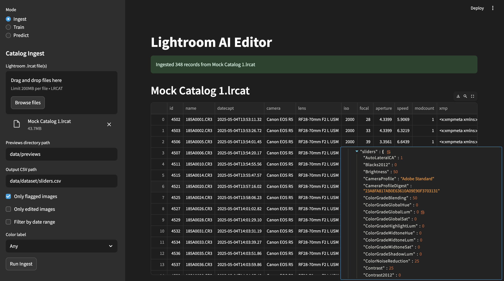

# Lightroom AI Editor

Teach a pre-trained AI model to edit photos like you, right from your browser. This locally-hosted data app allows you to easily ingest Lightroom catalog files, train and save models, and generate predictive Lightroom develop settings and/org XMP data for images.



## Getting started

### Requirements

- Python 3.9+
- [Exempi 2.2.0+](https://libopenraw.freedesktop.org/exempi/) (for [Python XMP Toolkit](https://python-xmp-toolkit.readthedocs.io/en/latest/installation.html#requirements)) - installed by start script

### Run the app

Run the start scrpt to initialize venv, install all dependencies, start the app, and open the UI:
```
# UNIX-like environments
./run.sh

# Cross-platform Python launcher
python3 run.py
```

### Dependencies
- [Streamlit](https://streamlit.io/)
- [Pandas](https://pypi.org/project/pandas/)
- [PyTorch](https://pytorch.org/)
- [Lightroom-SQL-tools](https://github.com/fdenivac/Lightroom-SQL-tools)
- [Python XMP Toolkit](https://python-xmp-toolkit.readthedocs.io/en/latest/installation.html#requirements)
- [Luadata](https://pypi.org/project/luadata/)

## Ingest

Drag-and-drop as many Lightroom catalog `.lrcat` files into the UI as you want. Click "Run Ingest" to extract image metadata, decode [Adobe XMP](https://www.adobe.com/products/xmp.html) data, and parse internal develop settings.

## Train

Train and save models using previously ingested slider datasets in `.csv` format.  References unedited image previews to learn ideal slider settings based on raw image data.

Can be run as a module via command line as well like:
```
# Activate venv if not already
source .venv/bin/activate

python -m train \
  --csv /data/dataset/sliders.csv \
  --previews /data/previews \
  --out_model /data/models/model.pt \
  --epochs 5 \
  --batch_size 32
```

## Predict

Use model inference to predict slider values given image file inputs. The goal is for the trained model to independently generate XMP side-car files and/or internal Lightroom develop settings from image inputs, so that when you open Lightroom, all your images are already edited in your style.

## Lightroom Tools

Using [Lightroom-SQL-tools](https://github.com/fdenivac/Lightroom-SQL-tools) to handle extracting data from `.lrcat` files.

See the [full .lrcat table schema here](./docs/example_lrcat_schema.sql), and an [example XMP file here](./docs/example_xmp.xml)

From my digging, the tables of interest are:
1.	`Adobe_AdditionalMetadata`
  - Column: xmp (TEXT) — contains the full XMP side-car XML for each image.
2.	`Adobe_imageDevelopSettings`
  - Columns: numeric fields like grayscale, hasPointColor. You can still pick up a handful of basic flags here, but the heavy lifting lives in the text column, which is a Lua-like data objecet with essentially all the develop settings that would be in the Camera Raw Settings namespace of the XMP. Unfortunately, the CRS attributes are not always included in the XMP dta returned from the catalog (this is a setting in Lightroom). That makes this table more reliable than going to the XMP. Unfortunately^2, Lightroom-SQL-tools doesn't currently support this data yet, so we have to get it ourselves with sqlite3.
3.	`AgHarvestedExifMetadata`
  - Columns: aperture, shutterSpeed, isoSpeedRating, cameraModelRef, dateYear/dateMonth/dateDay, etc.

## Tests

Run `pytest` to run all tests under [tests/](./tests/)
