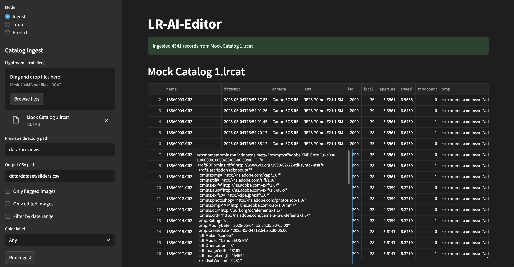

# Lightroom AI Editor

Teach a pre-trained AI model to edit photos like you with this locally-hosted [Streamlit](https://streamlit.io/) app that opens in your browser. Drag-and-drop images and Lightroom catalog files, train and save models, and create predictive XMP data for images.

Parses [Adobe XMP](https://www.adobe.com/products/xmp.html) data from edits in your catalogs, and trains a model based on camera raw sliders, with the goal of creating XMP side-car files for new images.



## Requirements

- Python 3.9+
- [Exempi 2.2.0+](https://libopenraw.freedesktop.org/exempi/) (for [Python XMP Toolkit](https://python-xmp-toolkit.readthedocs.io/en/latest/installation.html#requirements)) - installed by start script

Run the start scrpt to initialize venv, install all dependencies, start the app, and open the UI:
```
# UNIX-like environments
./run.sh

# Cross-platform Python launcher
python run.py
```

## [Ingest](./ingest/)

Extract image data from Lightroom catalog `.lrcat` files

## [Train](./train/)

Train a model based on previously ingested slider data.

## Lightroom Tools

Using [Lightroom-SQL-tools](https://github.com/fdenivac/Lightroom-SQL-tools) to handle extracting data from `.lrcat` files.

See the [full .lrcat table schema here](./lrcat_schema.sql).

From my digging, the tables of interest are:
1.	`Adobe_AdditionalMetadata`
  - Column: xmp (TEXT) — contains the full XMP side-car XML for each image.
2.	`Adobe_imageDevelopSettings`
  - Columns: numeric fields like grayscale, hasPointColor, but not slider values (Lightroom moved to XMP). You can still pick up a handful of basic flags here, but the heavy lifting lives in the XMP.
3.	`AgHarvestedExifMetadata`
  - Columns: aperture, shutterSpeed, isoSpeedRating, cameraModelRef, dateYear/dateMonth/dateDay, etc.
