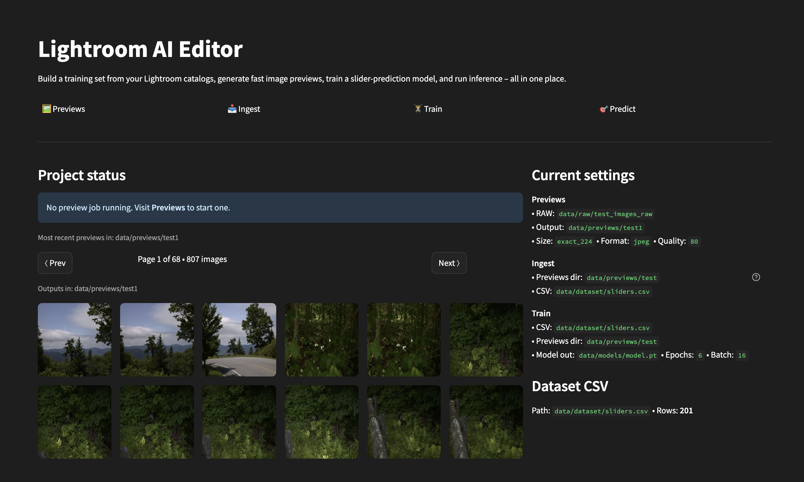
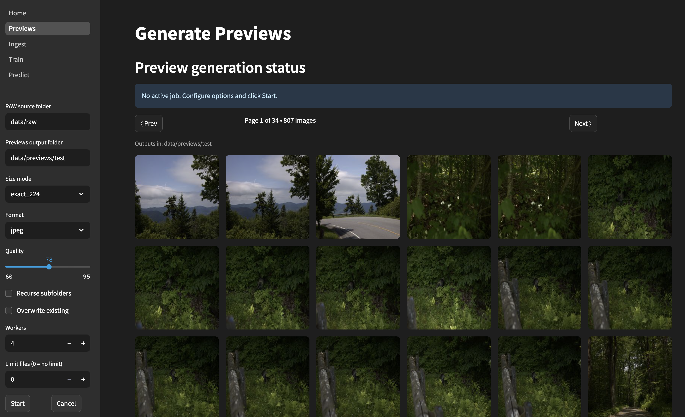
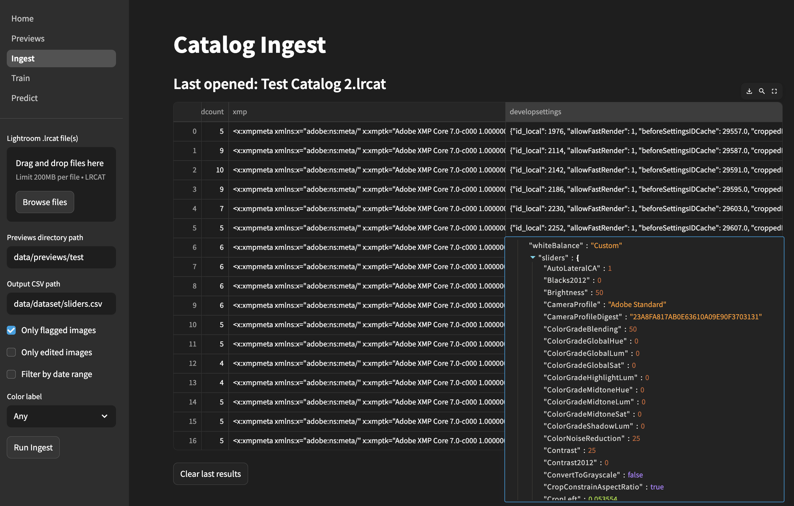
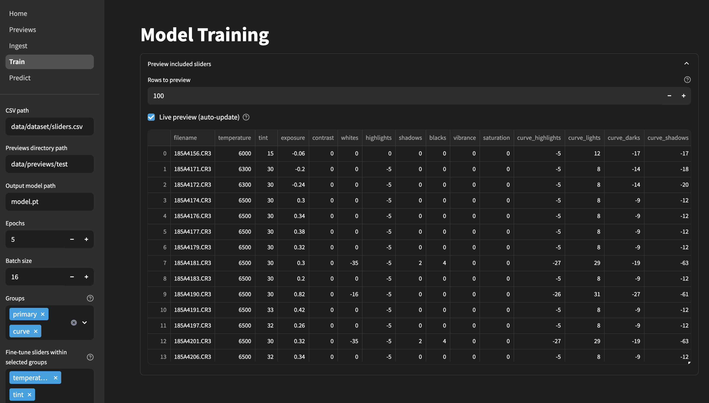

# Lightroom AI Editor

Teach a pre‑trained AI model to edit photos like you — locally, in your browser.  
Generate training datasets from RAW files, ingest Lightroom catalogs, train a model on your style, and predict Lightroom develop settings/XMP for new images.



---

## Table of contents
- [Features](#features)
- [Requirements](#requirements)
- [Quick start](#quick-start)
- [How it works](#how-it-works)
  - [Previews](#previews)
  - [Ingest](#ingest)
  - [Train](#train)
  - [Predict (WIP)](#predict-wip)
- [CLI usage](#cli-usage)
- [Troubleshooting](#troubleshooting)
- [Notes on Lightroom catalogs](#notes-on-lightroom-catalogs)
- [Tests](#tests)
- [Roadmap](#roadmap)

---

## Features

- **Multipage Streamlit app** (Home, Previews, Ingest, Train, Predict)
- **Preview generator**: Convert RAWs (CR3/CR2/DNG/NEF/ARW/RAF/RW2/ORF/SRW) to fast, model‑ready previews (JPEG/WebP). Background job with live progress, reclaim on refresh, paginated thumbnail grid.
- **Limit by CSV**: On Previews, optionally **generate only files referenced in a dataset CSV** (matches by filename stem, e.g., `IMG_0001.*`).
- **Catalog ingest**: Drag‑and‑drop Lightroom `.lrcat` files to extract EXIF/XMP and internal develop settings into a clean CSV.
- **Training‑set controls**: Train on only the sliders you care about (group + fine‑tune selectors) with a live table preview.
- **Training**: Image → slider regression (PyTorch). Robust preview resolution (case‑insensitive, recursive, stem‑aware) and automatic skipping of missing files. Labeled loss chart + run metrics.
- **Prediction (WIP)**: Upload images to get predicted slider values with the trained model.
- **State that survives refresh**: App settings are saved to a JSON file at the **repo root** (`.lr_ai_editor_state.json`).

---

## Requirements

- Python **3.9+**
- **Exempi 2.2.0+** (for [Python XMP Toolkit](https://python-xmp-toolkit.readthedocs.io/en/latest/installation.html#requirements))
- **rawpy** (LibRaw) for RAW → RGB conversion

> The included start script installs Python deps and Exempi where possible. See Troubleshooting for platform notes.

---

## Quick start

Run the start script to create a virtual env, install dependencies, start the app, and open the UI:

```bash
# UNIX-like environments
./run.sh

# Cross-platform Python launcher
python3 run.py

# Or run Streamlit directly
streamlit run Home.py
```

Then open your browser to the Streamlit app if it didn’t auto‑open.

---

## How it works

### Previews

Convert RAW camera files into small RGB images for training/inference.

- **Input formats:** CR3, CR2, DNG, NEF, ARW, RAF, RW2, ORF, SRW
- **Output formats:** JPEG or WebP, sRGB, 8‑bit
- **Sizing:** `exact_224` (fast) or `short256_center224` (less distortion). You can also keep original size.
- **CSV filter:** Optional **Limit to images listed in a dataset CSV** (matches by `name` column’s **stem**; extension/subfolders are ignored).
- **Status:** Background job with live progress that survives page switches and is reclaimed after browser refresh.
- **Gallery:** Paginated thumbnails from the output folder; auto‑refresh during active jobs.



### Ingest

Drag and drop one or more Lightroom `.lrcat` catalogs. Click **Run Ingest** to extract metadata and parse develop settings into a CSV suitable for training.

- Filters: flagged, date range, color label (local filter for “edited”).  
- Always shows the **current dataset CSV** located at your configured **Output CSV path** (path + row count + preview table).



### Train

Train a model using your CSV and previews. Choose which sliders to include via **group** and **fine‑tune** selectors. A preview table shows only the filename + selected sliders so you can verify what will be used.

- **Only `exposure`** is treated as a floating‑point value (display as `0.00`). All other sliders are integer‑valued.
- **Data sanity:** Training uses an existence‑aware dataset that resolves previews **recursively** and **case‑insensitively** by **stem** (e.g., `IMG_0001.CR3` → `IMG_0001.jpg`) and **skips missing previews**.
- **Training data summary:** Clear metrics (Rows in CSV, Previews, Usable) and a thumbnail grid of usable previews.
- **Run metrics:** Duration, epochs, samples used, final loss with delta, and an approximate throughput (images/sec). Labeled loss chart (Epoch vs Training Loss).



### Predict (WIP)

Upload images and run inference to predict slider values with your trained model.  
The goal is to generate XMP sidecars and/or internal Lightroom develop settings so your images open pre‑edited in your style.

---

## CLI usage

You can also run core steps from the command line.

### Ingest from a catalog

```bash
# Activate venv if not already
source .venv/bin/activate

python -m modules.ingest \
  --catalog /data/raw/catalog.lrcat \
  --out_csv /data/dataset/sliders.csv \
  --criteria "flag=flagged,colorlabel=green"
```

### Train a model

```bash
# Activate venv if not already
source .venv/bin/activate

python -m modules.train \
  --csv /data/dataset/sliders.csv \
  --previews /data/previews \
  --out_model /data/models/model.pt \
  --epochs 5 \
  --batch_size 32 \
  --sliders "temperature,tint,exposure,contrast,whites,highlights,shadows,blacks"
```

> Tip: `--sliders` is a comma‑separated list of **friendly names** (see [`modules/sliders.py`](./modules/sliders.py)).  
> The order given is the output order the model learns.

---

## Troubleshooting

**rawpy (LibRaw) install**
- macOS (Homebrew): `brew install libraw` (then `pip install rawpy`)
- Linux: ensure `libraw`/image codecs are present via your package manager
- Windows: use prebuilt wheels if available; otherwise install Visual C++ Build Tools

**Exempi / Python XMP Toolkit**
- macOS (Homebrew): `brew install exempi`
- Linux: `apt install exempi` (or your distro equivalent)
- Windows: see the XMP Toolkit docs for packaged libs or build steps

**Streamlit runtime warnings**
- If you see messages like _“missing ScriptRunContext / Session state does not function / No runtime found”_, they typically come from **PyTorch DataLoader workers** (separate processes).  
  **Fix:** set `num_workers=0` (and `persistent_workers=False`) in training.
- Launch the app with `streamlit run Home.py` (not `python Home.py`).

**Persistent settings file**
- Settings are saved at the repo root: `.lr_ai_editor_state.json`.  
  Add to `.gitignore` if you don’t want to commit it.

---

## Notes on Lightroom catalogs

This project uses [Lightroom‑SQL‑tools](https://github.com/fdenivac/Lightroom-SQL-tools) to read `.lrcat` files (they're SQLite databases). From exploration, the tables relevant to photo editing are:

1. **Adobe_AdditionalMetadata**  
   `xmp` (TEXT) – full XMP sidecar XML per image. Currently, not much is done with this, and support for parsing it may be removed to allow us to drop the dependency on Exempi.
2. **Adobe_imageDevelopSettings**  
   Numeric flags and a Lua‑like text column mirroring Camera Raw Settings that often **isn’t** in XMP depending on Lightroom settings. We retrieve/parse this text column directly since Lightroom‑SQL‑tools doesn’t expose everything yet and Lua objects aren't natively supported in Python. This is where the majority of internal Lightroom **slider** data is hidden.
3. **AgHarvestedExifMetadata**  
   Aperture, shutter, ISO, camera model, date parts, etc.

See:
  - [current list of trainable sliders](./modules/sliders.py)
  - [example Adobe_imageDevelopSettings record](./docs/example_preview.df.json)
  - [example .lrcat schema](./docs/example_lrcat_schema.sql)
  - [example XMP file](./docs/example_xmp.xml)

---

## Tests

Run `pytest` to execute tests under [`tests/`](./tests/).

---

## Roadmap

- Debounce persisted state changes
- Show epoch progression in UI
- Graceful shutdown from CLI
- Validation split + early stopping during training
- Per‑slider normalization & image normalization/augmentation
- Model metadata (slider order, normalization stats) saved alongside the `.pt`
- Export predicted sliders / XMP sidecars
- GPU selection & mixed precision
- Persist preview job metadata to disk (optional) to reclaim after server restarts
