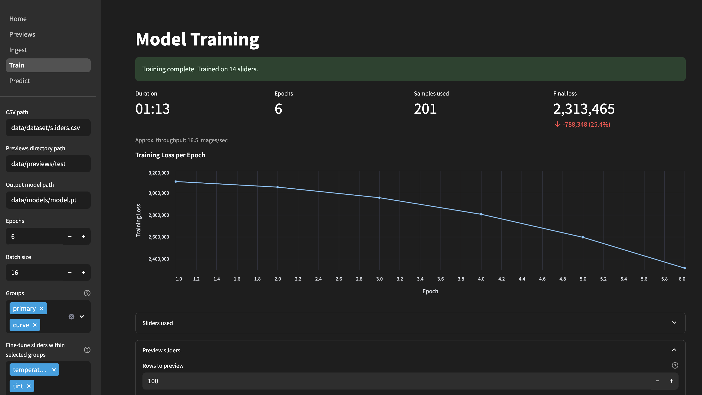

# Lightroom AI Editor

Teach a pre‑trained AI model to edit photos like you - locally, in your browser.  
Generate training datasets from RAW files, ingest Lightroom catalogs, train a model on your style, and predict Lightroom develop settings/XMP for new images.


---

## Table of contents
- [Features](#features)
- [Requirements](#requirements)
- [Quick start](#quick-start)
- [How it works](#how-it-works)
  - [Previews](#previews)
  - [Ingest](#ingest)
  - [Train](#train)
  - [Predict (WIP)](#predict-wip)
- [CLI usage](#cli-usage)
- [Troubleshooting](#troubleshooting)
- [Notes on Lightroom catalogs](#notes-on-lightroom-catalogs)
- [Tests](#tests)
- [Roadmap](#roadmap)

---

## Features

- **Multipage Streamlit app** (Home, Previews, Ingest, Train, Predict)
- **Preview generator**: Convert RAWs (CR3/CR2/DNG/NEF/ARW/RAF/RW2/ORF/SRW) to fast, model‑ready previews (JPEG/WebP). Background job with live progress and reclaim on refresh.
- **Catalog ingest**: Drag‑and‑drop Lighroom `.lrcat` files to extract EXIF/XMP and internal develop settings into a clean CSV.
- **Slider selection**: Train on only the sliders you care about (group and fine‑tune selectors).
- **Training**: Image → slider regression (PyTorch). Saves model and logs training loss.
- **Prediction (WIP)**: Upload images to get predicted slider values with the trained model.
- **State that survives refresh**: App settings are saved to `.lr_ai_editor_state.json` so switching pages or refreshing won’t lose your inputs. Ingest also keeps the last results table during the session.

---

## Requirements

- Python **3.9+**
- **Exempi 2.2.0+** (for [Python XMP Toolkit](https://python-xmp-toolkit.readthedocs.io/en/latest/installation.html#requirements))
- **rawpy** (LibRaw) for RAW → RGB conversion

> The included start script installs Python deps and Exempi where possible. See Troubleshooting for platform notes.

---

## Quick start

Run the start script to create a virtual env, install dependencies, start the app, and open the UI:

```bash
# UNIX-like environments
./run.sh

# Cross-platform Python launcher
python3 run.py
```

Then open your browser to the Streamlit app if it didn’t auto‑open.

---

## How it works

### Previews

The **Previews** page allows you to convert RAW camera files into small RGB images for training/inference.

- **Input formats** CR3, CR2, DNG, NEF, ARW, RAF, RW2, ORF, SRW
- **Output formats:** JPEG or WebP, sRGB, 8‑bit
- **Sizing:** `exact_224` (fast) or `short256_center224` (less distortion). You can also keep original size.
- **Status:** background job with live progress, survives page switches, and is reclaimed after a browser refresh.


### Ingest

Drag and drop one or more Lightroom `.lrcat` catalogs. Click **Run Ingest** to extract metadata and parse develop settings into a CSV suitable for training.

- Filters: flagged, date range, color label (local filter for “edited”).  
- Keeps the **last opened results table** in memory so switching pages doesn’t lose it.


### Train

Train a model using your CSV and previews. Choose which sliders to include via **group** and **fine‑tune** selectors. A preview table shows only the filename + selected sliders so you can verify what will be used.

- **Only `exposure`** is treated as a floating‑point value (display as `0.00`). All other sliders are integer‑valued.
- The model outputs one value per selected slider in the exact order shown.



### Predict (WIP)

Upload images and run inference to predict slider values with your trained model.  
The goal is to generate XMP sidecars and/or internal Lightroom develop settings so your images open pre‑edited in your style.

---

## CLI usage

You can also run core steps from the command line.

### Ingest from a catalog

```bash
# Activate venv if not already
source .venv/bin/activate

python -m modules.ingest \
  --catalog /data/raw/catalog.lrcat \
  --out_csv /data/dataset/sliders.csv \
  --criteria "flag=flagged,colorlabel=green"
```

### Train a model

```bash
# Activate venv if not already
source .venv/bin/activate

python -m modules.train \
  --csv /data/dataset/sliders.csv \
  --previews /data/previews \
  --out_model /data/models/model.pt \
  --epochs 5 \
  --batch_size 32 \
  --sliders "temperature,tint,exposure,contrast,whites,highlights,shadows,blacks"
```

> Tip: `--sliders` is a comma‑separated list of **friendly names** (see below).  
> The order given is the output order the model learns.

---

## Troubleshooting

**rawpy (LibRaw) install**
- On macOS with Homebrew: `brew install libraw` (then `pip install rawpy`)
- On Linux: ensure `libraw`/image codecs are present via your package manager
- Windows: use prebuilt wheels if available; otherwise install Visual C++ Build Tools

**Exempi / Python XMP Toolkit**
- macOS (Homebrew): `brew install exempi`
- Linux: `apt install exempi` (or your distro equivalent)
- Windows: see the XMP Toolkit docs for packaged libs or build steps

**Streamlit multipage quirks**
- Page titles come from filenames. We use numeric prefixes (`1_`, `2_`, …) to control order.
- Only the first page can set `st.set_page_config(...)` (we do this in `Home.py`).

**Previews job visibility**
- The background job is tracked in‑process and **reclaimed after browser refresh**.
- If you restart the server, the job registry resets (by design). You’ll still see completed previews in the gallery.

---

## Notes on Lightroom catalogs

This project uses [Lightroom‑SQL‑tools](https://github.com/fdenivac/Lightroom-SQL-tools) to read `.lrcat` files (they're essentially just SQLite databases). From exploration, the tables relevant to photo editing are:

1. **Adobe_AdditionalMetadata**  
   `xmp` (TEXT) – full XMP sidecar XML per image. Currently, not much is done with this, and support for parsing it may be removed to allow us to drop the dependency on Exempi.
2. **Adobe_imageDevelopSettings**  
   Numeric flags and a Lua‑like text column mirroring Camera Raw Settings that often **isn’t** in XMP depending on Lightroom settings. We currently retrieve/parse this text column directly, since Lightroom‑SQL‑tools doesn’t expose everything yet and Lua objects aren't natively supported in python. This is where the majority of internal Lightroom slier data is hidden.
3. **AgHarvestedExifMetadata**  
   Aperture, shutter, ISO, camera model, date parts, etc...

See:
  - [current list of trainable sliders](./modules/sliders.py)
  - [example Adobe_imageDevelopSettings record](./docs/example_preview.df.json)
  - [example .lrcat schema](./docs/example_lrcat_schema.sql)
  - [example XMP file](./docs/example_xmp.xml)

---

## Tests

Run `pytest` to execute tests under [`tests/`](./tests/).

---

## Roadmap

- Validation split + early stopping during training
- Per‑slider normalization & image normalization/augmentation
- Model metadata (slider order, normalization stats) saved alongside the `.pt`
- Export predicted sliders
- GPU selection & mixed precision
- Persist preview job metadata to disk (optional) to reclaim after server restarts
